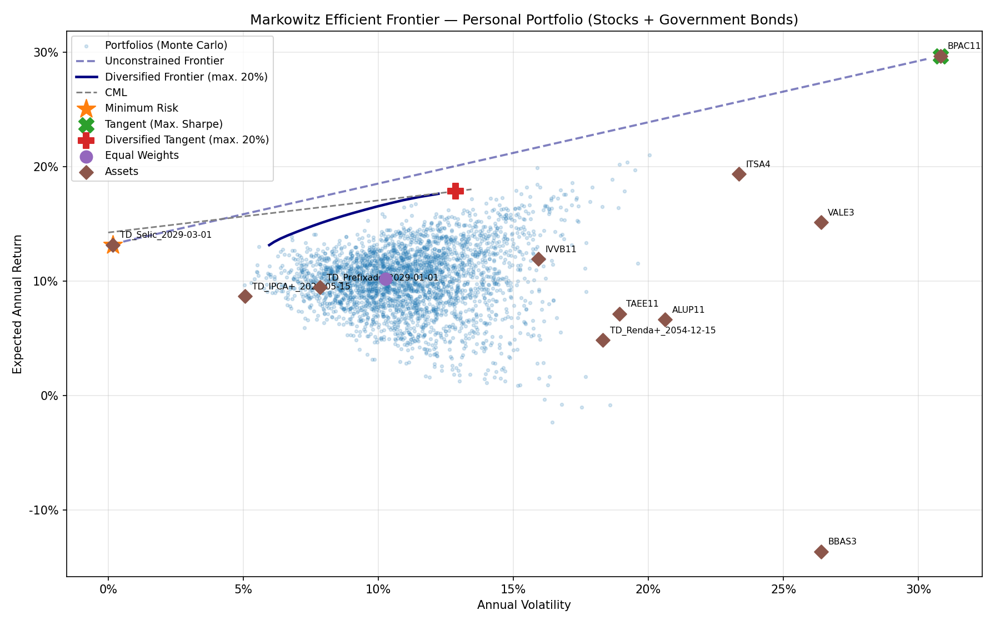

# modern-portfolio-theory-markowitz

# Markowitz Portfolio Optimization — Stocks & Government Bonds

This portfolio project implements the **Modern Portfolio Theory (MPT)** proposed by Harry Markowitz to optimize a personal investment portfolio combining Brazilian stocks (B3) and government bonds (Tesouro Direto).

## Summary

- [Motivation](#motivation)
  - [EN-🇺🇸](#EN-🇺🇸)
  - [PT-🇧🇷](#PT-🇧🇷)
- [What this project demonstrates](#what-this-project-demonstrates)
- [How Markowitz optimization works](#how-markowitz-optimization-works)
- [Project structure](#project-structure)
- [Setup](#setup)
  - [Requirements](#requirements)
  - [Install dependencies](#install-dependencies)
- [Usage](#usage)
  - [Configure your portfolio](#configure-your-portfolio)
  - [Ingest stock data](#ingest-stock-data)
  - [Ingest bond data](#ingest-bond-data)
  - [Run the optimization](#run-the-optimization)
- [Output](#output)
- [Notes](#notes)

---

## Motivation

### EN-🇺🇸

This project was built to apply quantitative finance concepts to a real personal portfolio, combining Brazilian equities from B3 with fixed-income government bonds from Tesouro Direto.

The goal was to go beyond theory and answer a practical question: **given the assets I actually hold, what is the optimal allocation?** The project pulls live market data, fetches the current risk-free rate (SELIC) from the Brazilian Central Bank API, and produces an efficient frontier with three portfolio recommendations: minimum risk, maximum Sharpe ratio, and a diversification-constrained version.

It was also an opportunity to explore how the presence of a near risk-free asset (Tesouro Selic) shapes the efficient frontier and Capital Market Line, and why a diversification constraint produces more realistic results than the unconstrained optimizer.

### PT-🇧🇷

Este projeto foi construído para aplicar conceitos de finanças quantitativas a uma carteira pessoal real, combinando ações da B3 com títulos do Tesouro Direto.

O objetivo foi ir além da teoria e responder uma pergunta prática: **dado o conjunto de ativos que tenho, qual é a alocação ótima?** O projeto busca dados de mercado atualizados, obtém a taxa livre de risco (SELIC) diretamente da API do Banco Central e gera a fronteira eficiente com três recomendações de carteira: mínimo risco, máximo Índice de Sharpe e uma versão com restrição de diversificação.

Foi também uma oportunidade de explorar como a presença de um ativo quase livre de risco (Tesouro Selic) molda a fronteira eficiente e a Capital Market Line, e por que uma restrição de diversificação produz resultados mais realistas do que o otimizador sem restrições.

---

## What this project demonstrates

- Fetching real Brazilian stock prices from Yahoo Finance via `yfinance`.
- Fetching government bond prices from the Tesouro Direto public API.
- Fetching the current SELIC rate from the Brazilian Central Bank API (`python-bcb`).
- Computing annualized expected returns and covariance matrices from daily returns.
- Building the **efficient frontier** using `PyPortfolioOpt`.
- Identifying three key portfolios: **minimum risk**, **maximum Sharpe**, and **diversification-constrained tangent**.
- Generating a **Monte Carlo simulation** of random portfolios to visualize the feasible set.
- Plotting the **Capital Market Line (CML)** anchored on the diversified tangent portfolio.
- Managing the full asset universe (stocks + bonds) through a single `portfolio_products.txt` configuration file.

---

## How Markowitz optimization works

Modern Portfolio Theory states that for any level of expected return, there is a portfolio that minimizes risk (volatility). The set of all such optimal portfolios forms the **efficient frontier**.

```
Expected Return
      |                                       * Max Sharpe (Tangent)
      |                                  *
      |                            *   (Efficient Frontier)
      |                       *
      |                  * (Minimum Risk)
      |         *  *  *
      |   *  *
      +----------------------------------------> Volatility (Risk)
```

**Key concepts used in this project:**

| Concept | Description |
|---|---|
| Expected Return (μ) | Annualized mean of daily returns × 252 trading days |
| Covariance Matrix (Σ) | Annualized covariance of daily returns × 252 |
| Minimum Risk Portfolio | Minimizes portfolio volatility regardless of return |
| Tangent Portfolio | Maximizes the Sharpe ratio — best return per unit of risk |
| Sharpe Ratio | `(Return − Risk-free rate) / Volatility` |
| Capital Market Line | Line from the risk-free rate tangent to the efficient frontier |
| Diversification Constraint | Caps each asset at `MAX_WEIGHT_PER_ASSET` to avoid concentration |

**Why add a diversification constraint?**

The unconstrained optimizer often concentrates 100% in one or two assets — mathematically optimal given historical data, but impractical for a real portfolio. Capping each asset (e.g. at 20%) forces the optimizer to spread allocation across more assets, producing a more realistic and robust recommendation.

## Output

**Console summary:**

```
================================================
  PERSONAL PORTFOLIO SUMMARY
================================================
Risk-free rate (SELIC) : 14.25%
Period                 : 2024-07-02  ->  2026-06-05
Number of assets       : 11

-- Minimum Risk Portfolio --
                           Weight
Tesouro_Selic_2029-03-01   0.9984
...
Return: 13.15%  |  Volatility: 0.17%  |  Sharpe: -6.514

-- Tangent Portfolio (Max. Sharpe) --
           Weight
BPAC11.SA   1.0
Return: 29.69%  |  Volatility: 30.82%  |  Sharpe: 0.501

-- Diversified Tangent Portfolio (max. 20% per asset) --
                          Weight
BPAC11.SA                  0.20
ITSA4.SA                   0.20
IVVB11.SA                  0.20
Tesouro_Selic_2029-03-01   0.20
VALE3.SA                   0.20
Return: 17.86%  |  Volatility: 12.87%  |  Sharpe: 0.280
```

**Chart** (`img/efficient_frontier.png`):



The output chart displays:
- Monte Carlo cloud of 3,000 random portfolios
- Unconstrained efficient frontier (dashed)
- Diversified efficient frontier (solid) — main reference
- Capital Market Line anchored on the diversified tangent
- Key portfolio markers: minimum risk ★, tangent ✕, diversified tangent ✚, equal weights ●
- Individual asset positions ◆

---

## Notes

- **Short selling is not allowed** — all weights are constrained to `[0, 1]`.
- **The risk-free rate is fetched live** from the Brazilian Central Bank SGS API (series 432 — SELIC daily rate). No manual update needed.
- **Why does the unconstrained frontier look like a straight line?** When one asset dominates the Sharpe ratio and another dominates minimum risk (e.g. Tesouro Selic), the unconstrained optimizer only mixes those two assets, producing a line rather than a curve. The diversification constraint fixes this by forcing the optimizer to consider the full asset universe.
- **Negative Sharpe on minimum risk portfolio** is expected when the SELIC rate is higher than the return achievable at minimum volatility — which is common in high interest rate environments like Brazil's.
- Bond prices come from Tesouro Direto's public dataset, which goes back to 2002. The optimization window is automatically aligned to match the stock data period.

---

## Project structure

```
.
├── data/
│   ├── stock_return.csv          # Daily stock return data (generated)
│   ├── treasure_return.csv       # Daily bond return data (generated)
│   └── efficient_frontier.png    # Output chart (generated)
├── src/
│   ├── stock_ingestion.py        # Downloads stock prices from Yahoo Finance
│   ├── treasure_ingestion.py     # Downloads bond prices from Tesouro Direto
│   └── markowitz.py              # Main optimization script
├── portfolio_products.txt        # Asset configuration file
└── README.md
```

---

## Setup

### Requirements

- Python 3.10 or newer
- Internet connection (for live data ingestion)

### Install dependencies

This project uses `uv` to manage Python packages and the virtual environment.

```bash
uv init .
uv venv
uv sync
```

If you need to add a new library later:

```bash
uv add <package-name>
```

Then activate the environment:

```bash
# Windows
.venv\Scripts\activate

# macOS / Linux
source .venv/bin/activate
```

If you prefer not to use `uv`, install dependencies manually with `pip`:

```bash
pip install yfinance pandas numpy matplotlib pyportfolioopt python-bcb
```

---

## Usage

### Configure your portfolio

Edit `portfolio_products.txt` to define which assets to include. Stocks go under `[STOCKS]` and government bonds under `[BONDS]` in the format `bond type,maturity date`:

```
[STOCKS]
VALE3.SA
BPAC11.SA
ITSA4.SA
IVVB11.SA
BBAS3.SA
ALUP11.SA
TAEE11.SA

[BONDS]
Tesouro IPCA+,2029-05-15
Tesouro Prefixado,2029-01-01
Tesouro Selic,2029-03-01
Tesouro Renda+ Aposentadoria Extra,2054-12-15
```

You can find available bond types and maturities on the [Tesouro Direto website](https://www.tesourodireto.com.br).

### Ingest stock data

Downloads the last 2 years of daily closing prices for all tickers in `[STOCKS]` and computes daily returns:

```bash
python src/stock_ingestion.py
```

Output: `data/stock_return.csv`

### Ingest bond data

Downloads the full historical price series from Tesouro Direto's public API and computes daily returns:

```bash
python src/treasure_ingestion.py
```

Output: `data/treasure_return.csv`

### Run the optimization

```bash
python src/markowitz.py
```

At the top of `markowitz.py`, you can adjust the diversification constraint:

```python
MAX_WEIGHT_PER_ASSET = 0.20  # Maximum allocation per asset (20%)
```

Lowering this value forces more diversification. With 11 assets, the minimum feasible value is ~9%. If the optimizer cannot find a solution under the given constraint, the script will print an informative message with a suggested adjustment.

---

